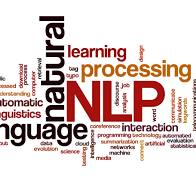

# Text sentiment classifier

This project is my first attempt at implementing Natural Language processing with NLTK. It classifies input text and tweets as either having **Positive** or **Negative** connotation/sentiment.

## Runthrough of usage

The user could use the first input box, and type in a simple sentence. The model classifies the sentence as having a negative or positive connotation (Might not fare well with complex scenarios), and gves an output with a level of certainty.

For the second input, you can copy the link to any tweet and paste it into the input. The app scrapes the tweet text from the web, using Selenium and BeautifulSoup libraries.

### Technologies utilized

* Natural Language ToolKit (NLTK)
* Selenium/Beautiful Soup 4(web scraping)
* Streamlit(For the web app/UI)

Data gotten from Kaggle

